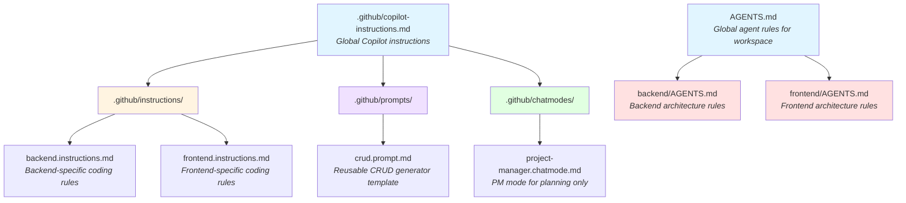

# VSCode Copilot agents demo

## About this repo

This is a demo as of October 2025 about how you can use AI agents in VSCode, showing the different configurations available: prompts, agents, instructions, ...
All the code here was generated using these. Yoy can find the steps and prompts used in [DEMO.md](DEMO.md).

In order to enable the experimental nested AGENTS.md feature, you will need the following VSCode setting, already included in the `.vscode` folder of this repo:

```json
{
  "chat.useNestedAgentsMdFiles": true
}
```

## Documentation

- [Visual Studio Docs - Customize chat to your workflow](https://code.visualstudio.com/docs/copilot/customization/overview)
- [September 2025 v1.105 update - Support for nested AGENTS.md files (experimental)](https://code.visualstudio.com/updates/v1_105#_support-for-nested-agentsmd-files-experimental)

## Agents file structure



### Agent Files Explanation

- **`.github/copilot-instructions.md`**: Global Copilot instructions that apply to all code in the workspace. Defines general coding standards, Node.js version, TypeScript strictness, and testing requirements.

- **`AGENTS.md` (root)**: Global agent rules that define the overall project architecture, separating backend and frontend concerns, and establishing API routing conventions.

- **`.github/instructions/`**: Contains file-pattern-specific instructions that automatically apply when working with matching files:
  - `backend.instructions.md`: Rules for backend TypeScript files (DTOs, service layer, controller patterns)
  - `frontend.instructions.md`: Rules for frontend React/TypeScript files (component patterns, accessibility, hooks)

- **`.github/prompts/`**: Reusable prompt templates that can be invoked via `#` in chat:
  - `crud.prompt.md`: Template for generating complete CRUD endpoints with tests

- **`.github/chatmodes/`**: Custom chat modes that change Copilot's behavior:
  - `project-manager.chatmode.md`: Planning-only mode that creates task specifications in `ai-backlog/` without editing code

- **`backend/AGENTS.md`**: Backend-specific architecture rules (Express patterns, CORS configuration, testing setup)

- **`frontend/AGENTS.md`**: Frontend-specific architecture rules (React patterns, Vite setup, styling approach)

## Development

### Install Dependencies

From project root, install backend and frontend dependencies separately:

```bash
cd backend && npm install
cd ../frontend && npm install
```

### Run Backend

```bash
cd backend
npm run dev
```

The backend exposes the Todo API at `/api/todos`.

### Run Frontend

In another terminal:

```bash
cd frontend
npm run dev
```

Open the shown localhost URL. The frontend expects the backend on the same origin (e.g. using a reverse proxy) or you can configure a dev proxy in Vite if needed.

### Frontend Todo App Features

- List all todos (GET /api/todos)
- Create a todo (POST /api/todos)
- Toggle completion (PUT /api/todos/:id)
- Optimistic UI for create & toggle with rollback on error

### Testing Frontend

We use Vitest + React Testing Library.

```bash
cd frontend
npm test
```

### Next Improvements (Suggestions)

- Add deletion support in UI
- Add filtering (all / active / completed)
- Add loading skeletons
- Add error boundary & retry logic
- Introduce React Query for caching & invalidation
- Implement accessibility improvements (focus management, ARIA live regions)
